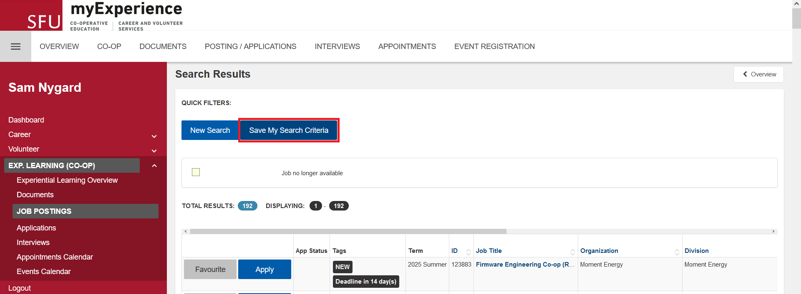
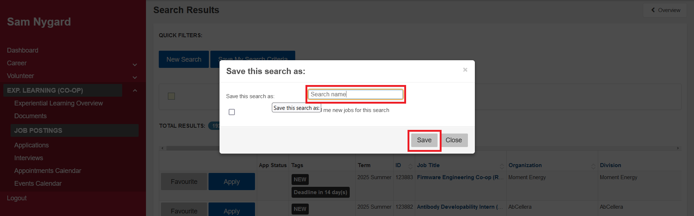

Coop Applier
===
Coop applier is a automation tool to help you apply to jobs on the SFU coop board. It uses python and the selenium and the firefox webdriver to do this task. It will choose from given cover letters and resume that match job title and replace symbols in your cover letter from the job description.

Requirements
---

Coop applier is a python script so python is required. I did all my testing on python 3.12.2

Unfortunately in order to edit the cover letter and return cover it to a pdf a copy of Microsoft Word must be installed.

Python dependencies: `selenium, pickle, shutil, docx, docx2pdf`

All of these dependencies can be installed using pip. So command should get you up and running.

`pip install selenium pickle shutil docx docx2pdf`

Lastly in order for selenium to interact with firefox you need to it needs the firefox webdriver

download the webdriver for your system here https://github.com/mozilla/geckodriver/releases

Using Coop applier
---
Before being able to apply to jobs for you Coop applier needs your documents. You will need to add at least one resume and at least one cover letter. The resume should be a pdf and the cover letter a docx

To give the program a cover letter use the `resume` command:

`python .\coop_applier resume [full_path_to_pdf] [Keyword] [Priorty]`

The keyword and priorty is how the program will choose which resume to use.

Similarly to give the program a cover letter use the `cover` command:

`python .\coop_applier cover [full_path_to_docx] [Keyword] [Priorty]`

Again the keyword and priorty is how the program will choose which cover letter template to use.

A cover letter template is a docx file that has things to replace within the document. Currently the program is not flexible in what it will replace.

| Withing document  | description of replacing text   |
| -------- | ------- |
|[Date]            | The current date|
|[Company]| The Company in the job description |
|[Title] | The title of the job |
|[Address] | The first line of the address, street and number from the job description |
|[City] | The city from the job description |
|[Postal] | The postal code or zip code from the job description |
|[Province] | The province or state from the job description |

An example cover letter could look like this

Now that the program has at least one cover letter and one resume, you need one more thing, a search template on the co-op board.

To create an search template login into the sfu co-op job board and click advanced search

Then set up your search and click search job posting at the bottom of the page

Now click Save my search criteria

And finally give your search a name and save

Running Coop applier
---
Now that you are all set up coop applier will finally apply to some job for you. Use the command `apply` to start.

`python .\coop_applier apply [username] [password] [name of search template]`

If you have two factor authentication you will need to watch the program and when promted input your code.

When the program is running is will create a TODO folder containing folders for each Job that needs extra work on your end. The extra work will most likely be applying on the company website, because of that you'll find the cover letter and resume use to apply to the job covinetely in the same folder.

Note
---

Make sure you have an up to date SIS and transcript on file because coop applier will use your most recently posted document of each.

Also all jobs that require more than a resume, cover letter, SIS and trascript will be not be applied too, sorry not don't have enough time to code that flexibility.
